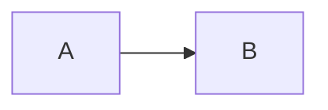

# mdview

A lightweight desktop viewer for Markdown. It opens a file, renders it, and does
nothing else.

- **Linux, macOS and Windows** from one binary, using the webview the operating
  system already ships. Nothing is bundled but the renderer.
- **CommonMark 0.31.2** — 652 of 652 specification examples.
- **GitHub Flavored Markdown** — tables, task lists, strikethrough, footnotes,
  alerts, extended autolinks and the raw-HTML tag filter.
- **Mermaid diagrams**, rendered offline from a vendored runtime.
- **Live reload** when the file changes on disk.
- **Sanitized output** behind a strict Content-Security-Policy, so a document
  from somewhere else cannot run script or reach the network.

## Install

macOS — download `mdview-macos-universal-app.tar.gz` from the
[releases page](https://github.com/yowmamasita/mdview/releases), unpack it and
drag `mdview.app` to Applications. It is signed and notarised, so it opens
without a warning. Or, if you prefer one command:

```sh
curl -fsSL https://raw.githubusercontent.com/yowmamasita/mdview/main/scripts/install-macos.sh | sh
```

Linux — download a tarball and run the `install.sh` inside it. Windows —
download the zip and run `mdview.exe`; see [A note on signing](#a-note-on-signing)
for the SmartScreen warning.

From source:

```sh
cargo install --path .
```

That puts `mdview` in `~/.cargo/bin`, so you can open a file from anywhere:

```sh
mdview README.md
```

Or build a release binary without installing it:

```sh
cargo build --release   # target/release/mdview
```

### Build requirements

Rust 1.85 or newer (2024 edition). macOS and Windows need nothing else — WKWebView
and WebView2 are part of the system. Linux needs the GTK and WebKitGTK development
packages:

```sh
# Debian / Ubuntu
sudo apt install libgtk-3-dev libwebkit2gtk-4.1-dev libdbus-1-dev pkg-config

# Fedora
sudo dnf install gtk3-devel webkit2gtk4.1-devel dbus-devel

# Arch
sudo pacman -S gtk3 webkit2gtk-4.1 dbus
```

## Use

```sh
mdview README.md
```

```
USAGE:
    mdview [OPTIONS] [FILE]

OPTIONS:
    -t, --theme <auto|light|dark>  Colour scheme (default: auto)
        --no-watch                 Do not reload when the file changes on disk
        --no-mermaid               Do not render Mermaid diagrams
        --print-html               Write a self-contained HTML page to stdout and exit
    -h, --help                     Print help
    -V, --version                  Print version information
```

Drop a file on the window to open it. Links to other Markdown files open in place;
everything else opens in your browser.

## Make it the default Markdown viewer

### macOS

Finder only offers *applications* as handlers, not bare executables, so this
builds `mdview.app`, installs it, and claims the Markdown types:

```sh
scripts/bundle-macos.sh --install
```

That covers every extension in the list above — `.md`, `.markdown`, `.mkd`,
`.rmd`, `.qmd` and the rest. Launch Services takes a few seconds to settle
afterwards.

To go back, right-click any `.md` file → *Get Info* → *Open with* → pick your
previous editor → *Change All…*.

Omit `--install` to build the bundle into `target/` without touching anything.

### Linux

```sh
scripts/install-linux.sh
```

Installs to `~/.local` and sets the association with `xdg-mime` — no root
needed.

### Windows

Right-click a `.md` file → *Open with* → *Choose another app* → browse to
`mdview.exe` → check *Always use this app*.

Release zips carry two executables. `mdview.exe` has no console, so opening a
document from Explorer raises no window behind the viewer; the price is that
shells do not wait for it and redirecting its output is unreliable.
`mdview-console.exe` is the same program with a console, for scripts. Building
it from source needs `--features windows-console`.

### Keys

| Key | Action |
| --- | --- |
| <kbd>Ctrl/Cmd</kbd>+<kbd>O</kbd> | Open a file |
| <kbd>Ctrl/Cmd</kbd>+<kbd>R</kbd>, <kbd>F5</kbd> | Reload |
| <kbd>Ctrl/Cmd</kbd>+<kbd>D</kbd> | Toggle dark mode |
| <kbd>Ctrl/Cmd</kbd>+<kbd>+</kbd> / <kbd>-</kbd> / <kbd>0</kbd> | Zoom in, out, reset |
| <kbd>Ctrl/Cmd</kbd>+<kbd>P</kbd> | Print |
| <kbd>g</kbd> / <kbd>G</kbd> | Top / bottom |
| <kbd>j</kbd> / <kbd>k</kbd> | Scroll down / up |
| <kbd>Ctrl/Cmd</kbd>+<kbd>Q</kbd> | Quit |

### Mermaid

Fenced blocks tagged `mermaid` become diagrams:

````markdown

````

The runtime is compiled into the binary, so diagrams render with no network
access. It is also most of the binary — 5.9 MB with it against 2.4 MB without,
stripped, on arm64 macOS. `cargo build --release --no-default-features --features gui`
leaves it out.

## How it works

When a file is opened from a file manager rather than the shell, macOS delivers
it as an Apple Event rather than an argument; `tao`'s `Event::Opened` carries it,
and it works whether the application was already running or not.

The window is `tao`; the page is `wry` driving the platform webview. Everything
the page loads — the document, its images, the stylesheet, the Mermaid runtime —
is served over a custom `mdview://` protocol whose path mirrors the filesystem.
That is what makes `../img/diagram.png` next to `/notes/deep/doc.md` resolve to
`/notes/img/diagram.png` by ordinary URL resolution, with no rewriting, and what
makes a link to a sibling `.md` file just another navigation.

Markdown is parsed by [`pulldown-cmark`](https://github.com/pulldown-cmark/pulldown-cmark).
Three things are layered on top of it in `src/markdown.rs`:

- **Extended autolinks** (`src/autolink.rs`), a port of `cmark-gfm`'s algorithm,
  which `pulldown-cmark` does not implement.
- **The `tagfilter` rule**, which neutralises raw `<script>`, `<iframe>` &co.
- **GitHub's alert and task-list markup**, which `pulldown-cmark` recognises but
  renders more minimally than GitHub does.

Output is then sanitized against an allowlist (`src/sanitize.rs`) and the page is
served under a Content-Security-Policy with `default-src 'none'` and
`connect-src 'none'`. A document cannot execute script, submit a form, be framed,
or make a network request — belt and braces, because a viewer is routinely
pointed at files that came from elsewhere.

## A note on signing

**macOS releases are signed with a Developer ID certificate, notarised by Apple
and stapled.** They open with no warning, and no `xattr` incantation, even when
downloaded through a browser. The release workflow asserts as much before
publishing:

```
target/mdview.app: accepted
source=Notarized Developer ID
```

**Windows releases are not signed.** An Authenticode certificate costs money and
there isn't one, so SmartScreen reports an unrecognised publisher — *More info*
→ *Run anyway*.

### Setting it up in a fork

Signing is driven entirely by repository secrets; the workflow needs no changes.

```sh
scripts/setup-signing.sh ~/Downloads/AuthKey_XXXXXXXX.p8 <key-id> <issuer-id>
```

That exports your Developer ID certificate and stores it, with an App Store
Connect API key, as the six secrets the workflow looks for. Without them builds
fall back to an ad-hoc signature rather than failing.

Two things are worth knowing before you run it:

- The certificate must be a **Developer ID Application** one. *Apple Development*
  signs builds for your own machines and *Apple Distribution* signs App Store
  submissions; neither can sign software distributed outside the App Store.
  Creating one costs nothing on an existing paid membership, but only through
  Xcode or the web portal — the App Store Connect API refuses it with *"This
  operation can only be performed by the Account Holder."*
- `security export` cannot select a single identity; it takes every identity in
  the keychain. The script therefore narrows the export down to the one
  certificate that signs releases, so an App Store identity or a TLS client
  certificate does not end up in a CI secret alongside it.

Building from source sidesteps the question entirely.

## Conformance

```sh
cargo test
```

The specification suites run the official documents verbatim:

| Suite | Result |
| --- | --- |
| CommonMark 0.31.2 (`spec.json`, 652 examples) | 652 / 652 |
| GFM (`spec.txt`, 670 active examples) | 668 / 670 |

Comparison is normalised the way the reference runners normalise by default —
`tests/common/html.rs` is a port of their `normalize.py`, so insignificant
whitespace, attribute order and entity spelling are folded away while any real
difference in the rendered document still fails. Under byte-exact comparison
CommonMark scores 651 / 652.

Everything that does not match is enumerated in the test files rather than
hidden by a looser comparison:

- **CommonMark example 175** — `pulldown-cmark` writes `<li><div>` where the
  reference writes `<li>\n<div>`. Identical once parsed; the only byte-exact
  deviation.
- **GFM examples 199 and 205** — column alignment is expressed as
  `style="text-align: center"` rather than the obsolete `align` attribute, and a
  header-only table keeps an empty `<tbody>`.
- **Nine GFM emphasis examples** — GFM's `spec.txt` is derived from CommonMark
  0.29, whose emphasis rules have since changed. A test proves each one matches
  what CommonMark 0.31.2 requires for the same input, rather than asserting it.

Beyond the specifications, the suite covers the autolink scanner against the
reference algorithm's edge cases, the sanitizer against script, event-handler,
`javascript:` and form-injection vectors, page assembly and the CSP, the URL
scheme's round trips and Windows drive paths, the file watcher's debouncing and
atomic-replace handling, and the binary's own command line.

## Licence

MIT. See [LICENSE](LICENSE).

Mermaid is bundled under its own MIT licence.
