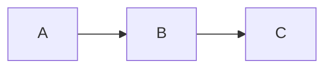
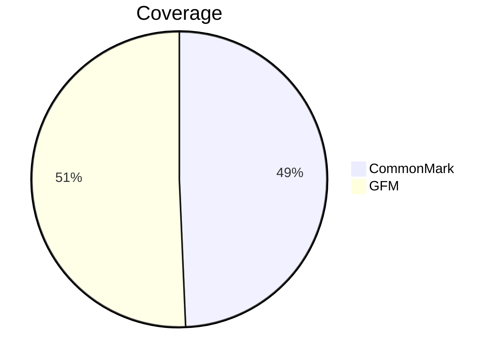

# Kitchen sink

Every construct the viewer claims to support, in one file.

## Inline

*emphasis*, **strong**, ***both***, `code`, ~~struck~~, <em>raw HTML</em>,
a [link](https://example.com "with a title"), an ,
a bare www.example.com, a URL https://example.org/path?q=1&r=2, and
mail@example.net.

Hard break at the end of this line.\
Second line.

Entity references: &amp; &copy; &#65; &#x42;.

Backslash escapes: \*not emphasis\* and \# not a heading.

## Lists

1. first
2. second
   - nested
   - items
3. third

- [x] finished
- [ ] pending

Term
: definition-ish paragraph

## Quotes and alerts

> A plain quote.
>
> > Nested.

> [!NOTE]
> A note.

> [!WARNING]
> A warning.

## Tables

| Left | Center | Right |
| :--- | :----: | ----: |
| a    |   b    |     c |
| `d`  | **e**  | ~~f~~ |

## Code

    indented code block

```rust
fn main() {
    println!("hi");
}
```

```
untagged fence
```

## Mermaid





## Raw HTML

<div class="custom">
  <p>Allowed.</p>
</div>

<script>alert("blocked")</script>
<iframe src="https://example.com"></iframe>

## Footnotes

A claim[^src] and another[^other].

[^src]: The source.
[^other]: The other source.

## Horizontal rules

---

***

___
